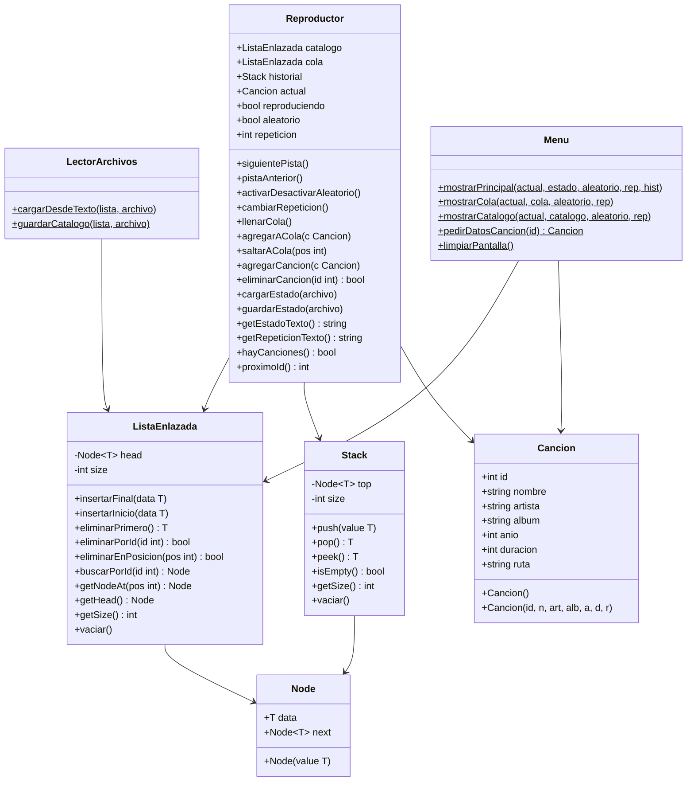

# Sierra's Music Player
### Integrantes:
* Benjamín Sierra
## Descripción del Proyecto
El reproductor de música Sierra's Music Player es un reproductor por consola escrito en C++, sin el uso de contenedores STL. Toda la gestión de datos se realiza con estructuras implementadas manualmente: lista enlazada, pila y cola con nodos. El programa carga un catálogo de canciones desde music_source.txt, permite navegar entre pistas,
activar modo aleatorio, repetición y gestionar una lista de reproducción.
El estado del reproductor se guarda automáticamente en status.cfg al realizar cualquier acción, permitiendo retomar la sesión exactamente donde se dejó.

## Diagrama de Clases


## Instrucciones de Compilación y Ejecución
**Clonar el proyecto:**
Abre la terminal en la carpeta donde quieras guardar el proyecto y ejecuta:
```bash
git clone https://github.com/benjaminsierraaguirre/taller1
```

**Acceder a la carpeta:**
Una vez clonado, entra al directorio del proyecto:
```bash
cd taller1
```

**Compilación con G++:**
```bash
g++ -std=c++14 main.cpp classes/Cancion.cpp core/LectorArchivos.cpp core/Reproductor.cpp core/Menu.cpp -o reproductor
```

**Ejecución:**

*   **En Windows:** `./reproductor.exe`
*   **En Linux/Mac:** `./reproductor`

## Funcionamiento de la Aplicación
Al ejecutar el programa, este leerá automáticamente el archivo music_source.txt. El usuario podrá interactuar mediante una interfaz de consola para ejecutar múltiples opciones, como lo son:
1. Reproducir/Pausar
2. Pista Anterior
3. Pista Siguiente
4. Activar/Desactivar modo aleatorio
5. Alternar modo de Repetición (Ninguna, Repetir Una, Repetir Todas)
6. Ver lista de reproducción actual
7. Listado de canciones
8. Salir
